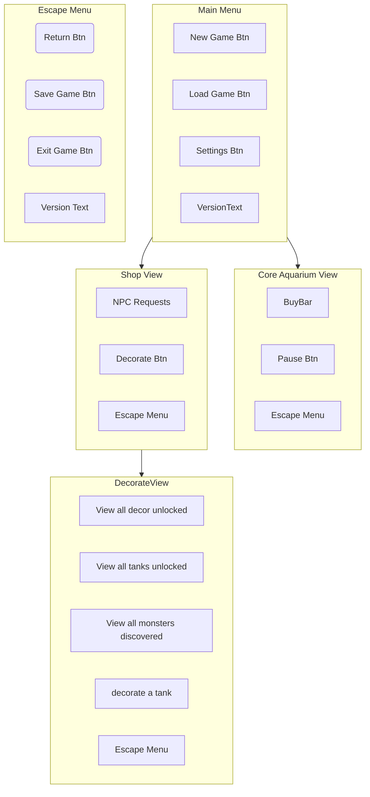

# UI Map

This document serves as a requirement list for how the player can navigate between each screen and the various elements available in each screen.
To render this diagram, use Mermaid in VS Code (Recommended).

## Navigation
